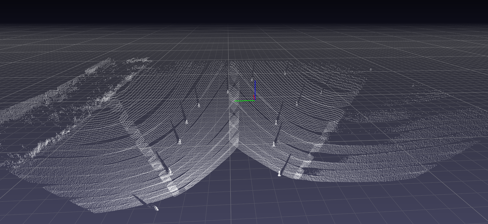
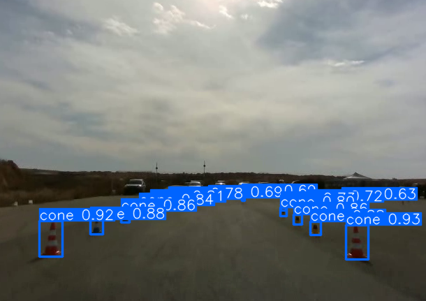
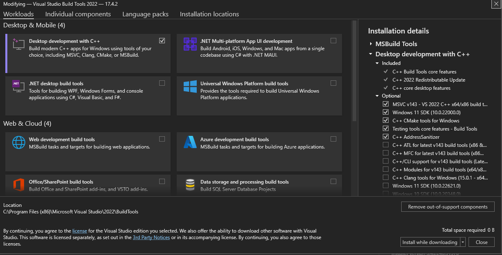
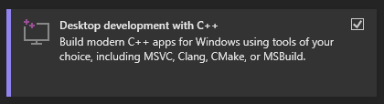

<h1 align="center"> Perception-Mapping </h1>
<table>
  <tr>
    <td style="width:50%"></td>
    <td style="width:50%"></td>
  </tr>
</table>

## Installations:
**Important**: If you want to use the <u>camera </u> or the <u>mapping projects only</u>, skip the lidar software installations.

### 1. Clone the project
``` 
git clone https://github.com/Amiros1322/PMProject.git
cd PMProject
```  
 
### 2. Create & activate the Anaconda environment 
* Install anaconda from [here](https://www.anaconda.com)
```
conda create -n pm_project python=3.6 anaconda
conda activate pm_project 
```

### 3. Install Innoviz`s lidar software requirements (skip this part if you want camera/mapping projects only)
* Install <a href=" https://visualstudio.microsoft.com/visual-cpp-build-tools/ ">visual-cpp-build-tools</a>.
<br>
In this window, select the following options:

<table>
  <tr>
    <td style="width:100%"></td>  
  </tr>
  <tr>
    <td style="width:100%"></td>
  </tr>
</table>

<br>
&nbsp;&nbsp;&nbsp;&nbsp;&nbsp;&nbsp;&nbsp;&nbsp;&nbsp;&nbsp;and install it.
<br>

* Install npcap
  * Download and install the latest npcap release from https://nmap.org/download.html
  * If you have WinPcap installed, permit npcap to uninstall WinPcap.

### 4. Install the python requirements (after activating the conda environment)
* <b><u> For the complete Perception-Mapping project:</u></b>
  * Install the requirements:
  ```
  pip3 install -r requirements.txt
  cd Sensors/Lidar
  python -m pip install tools/InnovizAPI/python
  cd ../../
  ```

  <!-- * Run the code:
  ```
  python ut/pm_ut.py
  ``` -->

* <b> For camera only: </b>
  
  * Install the requirements:
    ```
    cd Sensors/Camera
    pip3 install -r requirements.txt
    ```
  * Run the code:
    ```
    python ut/cameraUtRecord.py
    ```
    
* <b> For lidar only: </b>
  
  * Install the requirements and the Innoviz API python module
  ```
  cd Sensors/Lidar
  pip3 install -r requirements.txt
  python -m pip install tools/InnovizAPI/python
  ```
  * Run the code
  
      In order to run the unit test record code, you have to put an example recording folder in the `record_example` folder (you can download it from [here](https://drive.google.com/drive/folders/1tQMXf8ZPdBfWMpLH1PofaXAAVx_zpKfL)) and run the following command:
  ```
  cd ut
  python lidarUtRecord.py --record_path example_record/Recording_192.168.0.3_2022_11_27_02_47_07.invz --visualizer pptk --frame_num 1600
  ```

  

* <b> For IMU only: </b>

  * Install the requirements:
    ```
    cd IMU
    pip3 install -r requirements.txt
    ```
  * Run the code:
    ```
    python ut/kalman_filter_simulator.py
    ```
