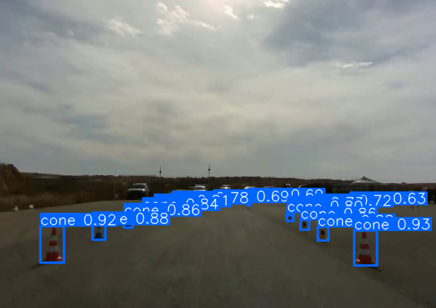

<h1 align="center"> Camera Project </h1>
<p align="center">
 
</p>

### Installations:
Please refer to the Perception-Mapping project [README](../../README.md) for the installations. 
### Run the code:
record unit test code:
  ```
  cd ut
  python cameraUtRecord.py --weights ../src/weights/bgracing_cones_detector_nano.pt --conf 0.5 --view-img --source record_example/record_motorcity.avi --nosave
  ```
In order to use your GPU, add ```--device 0``` to the arguments in the command line.


